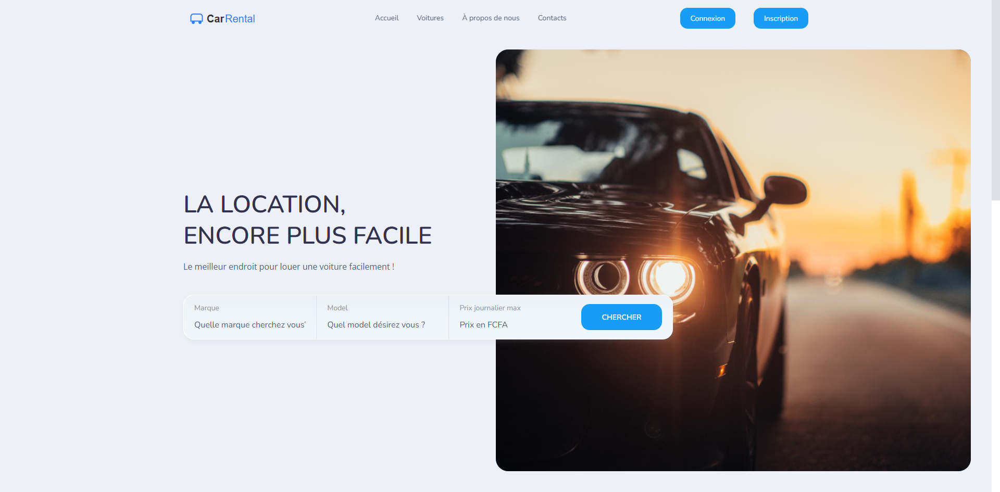
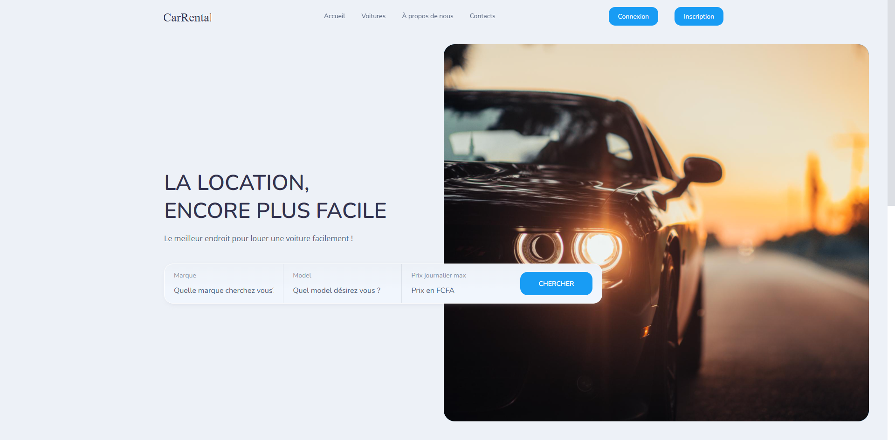

# Car Rental Platform

CarRental is a comprehensive car rental platform designed to simplify the process of renting cars. This repository contains the code for the website and administration panel built using Laravel and Bootstrap respectively.

## Screenshots

## Features

### User-Facing Website

- User registration and authentication.
- Browse and search available cars.
- Filter cars by location, date, and other specifications.
- Make online reservations and manage bookings.
- View rental history and invoices.

### Administration Panel

- Secure login for administrators.
- Manage car listings, including creation, editing, and deletion.
- Track and manage car availability and reservations.

## Getting Started

To set up and run CarRental on your local machine, follow these steps:

1. Clone this repository to your local machine.
2. Configure your development environment (e.g., PHP, MySQL).
3. Create a new MySQL database for CarRental.
4. Copy the `.env.example` file and rename it to `.env`. Update the necessary configuration variables, including the database credentials.
5. Install the project dependencies by running `composer install`.
6. Generate an application key by running `php artisan key:generate`.
7. Run the database migrations using `php artisan migrate`.
9. Start the development server using `php artisan serve`.
10. Access the CarRental website and administration panel by visiting `http://localhost:8000` and `http://localhost:8000/admin` respectively.

## License

CarRental is released under the [MIT License](LICENSE). You are free to use, modify, and distribute this project for personal or commercial purposes.

## Acknowledgments

We would like to extend our gratitude to the Laravel and Bootstrap communities for their fantastic frameworks that made developing CarRental a delightful experience.
